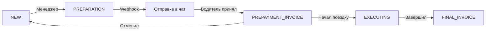

# MeetRide Telegram Bot

> Система автоматизации заявок на такси с интеграцией Bitrix24 CRM

[]()
[]()
[]()
[]()

## 📋 Содержание

- [О проекте](#о-проекте)
- [Функциональность](#функциональность)
- [Архитектура](#архитектура)
- [Установка](#установка)
- [Логика работы](#логика-работы)
- [Компоненты системы](#компоненты-системы)
- [Документация](#документация)
- [Мониторинг](#мониторинг)

---

## 🎯 О проекте

**MeetRide Bot** — это Telegram-бот для автоматизации управления заявками на такси с интеграцией Bitrix24 CRM. Система автоматизирует весь процесс от создания заявки до её выполнения, обеспечивая связь между диспетчерской и водителями через Telegram.

### Основные возможности:

- ✅ **Автоматическая отправка заявок** в общий чат водителей
- ✅ **Принятие заявок** любыми пользователями (зарегистрированными и новыми)
- ✅ **Полный workflow** (Принять → Начать → Завершить/Отменить)
- ✅ **Уведомления об изменениях** полей заявки в реальном времени
- ✅ **Система напоминаний** за час до поездки
- ✅ **Защита контактов** (пассажиры только в личные сообщения водителю)
- ✅ **Поддержка промежуточных точек маршрута**
- ✅ **Гибкая система классов автомобилей**

---

## 🚀 Функциональность

### Создание заявки

Бот парсит сообщения в Telegram и создает сделки в Bitrix24:

```
#️⃣ PT-1234
🚗 Комфорт
📆 25 декабря 2025 15:00
🅰️ Москва, Красная площадь
📍 ТЦ Афимолл
🅱️ Шереметьево, Терминал D
✈️ SU 1234
👥 Иванов Иван (+79001112233)
ℹ️ С детским креслом
💰 5000/4000
```

### Workflow заявки



### Telegram интеграция

**Два бота работают параллельно:**

1. **Бот создания заявок** (`telegram_to_bitrix.py`)
   - Токен: `7992462078:AAGJ46crBdOMSAuIfWncFd0AEjrDiT4Tnww`
   - Парсит заявки и создает сделки в Bitrix24

2. **Бот уведомлений** (`botManager.php`)
   - Токен: `7529690360:AAHED5aKmuKjjfFQPRI-0RQ8DlxlZARA2O4`
   - Обрабатывает кнопки и отправляет уведомления

---

## 🏗️ Архитектура

### Структура проекта

```
meetride/
├── botManager.php                  # Основная логика бота (Store\botManager)
├── telegram_to_bitrix.py          # Бот для создания заявок
├── reminder_scheduler_working.php # Система напоминаний (cron)
├── webhook_stage3.php             # Webhook для ручного назначения
│
├── src/
│   ├── index.php                  # Webhook обработчик от Bitrix24
│   └── crest/                     # Bitrix24 REST API клиент
│
├── config/
│   └── config.example.php         # Шаблон конфигурации
│
├── scripts/
│   ├── setup_cron.sh             # Настройка cron задач
│   └── ...                       # Другие утилиты
│
├── logs/                          # Логи системы
│   ├── webhook.log
│   ├── cron.log
│   └── reminder_scheduler.log
│
└── docs/                          # Документация
    ├── SETUP.md                   # Установка и настройка
    ├── TESTING.md                 # Инструкции по тестированию
    └── BITRIX24_INTEGRATION.md    # Настройка Bitrix24
```

### Технологический стек

**Backend:**
- PHP 7.4+ (основная логика)
- Python 3.8+ (парсинг заявок)
- Bitrix24 REST API
- Telegram Bot API

**Библиотеки:**
- `longman/telegram-bot` - PHP SDK для Telegram
- `pyTelegramBotAPI` - Python SDK для Telegram
- `CRest` - клиент для Bitrix24 API
- `Carbon` - работа с датами

**Инфраструктура:**
- Linux (Ubuntu/Debian)
- Apache/Nginx
- Cron (планировщик напоминаний)
- Git (контроль версий)

---

## 📦 Установка

### Требования

- PHP 7.4+
- Python 3.8+
- Composer
- Git
- Доступ к Bitrix24

### Быстрый старт

```bash
# 1. Клонировать репозиторий
git clone https://github.com/luxurygeorge-dev/meetride-bot.git
cd meetride-bot

# 2. Установить зависимости
composer install
pip3 install -r requirements.txt

# 3. Настроить конфигурацию
cp config/config.example.php config/config.php
# Отредактируйте config.php с вашими токенами

# 4. Настроить cron для напоминаний
./scripts/setup_cron.sh

# 5. Запустить бота создания заявок
python3 telegram_to_bitrix.py &
```

**Подробная инструкция:** [docs/SETUP.md](docs/SETUP.md)

---

## 🔄 Логика работы

### 1️⃣ Создание и отправка заявки

```
Telegram бот (telegram_to_bitrix.py)
   ↓ Парсит сообщение
   ↓ POST → Bitrix24 API
   ↓ Создается сделка в стадии NEW
   
Bitrix24
   ↓ Автоматический переход → PREPARATION
   ↓ Срабатывает webhook ONCRMDEALUPDATE
   
Webhook (src/index.php)
   ↓ Проверяет: GROUP_MESSAGE_SENT_FIELD пустое?
   ↓ Вызывает botManager::newDealMessage()
   
Telegram (общий чат)
   ✅ ОДНО сообщение с кнопками [✅ Принять] [❌ Отказаться]
   ✅ БЕЗ контактов пассажиров (конфиденциально)
```

### 2️⃣ Водитель принимает заявку

```
Водитель нажимает "✅ Принять"
   ↓
botManager::driverAcceptHandle()
   ↓ Назначает водителя в CRM
   ↓ Меняет стадию → PREPAYMENT_INVOICE
   ↓ Инициализирует SERVICE-поля для отслеживания изменений
   ↓ Отправляет уведомление в общий чат
   ↓ Отправляет детали В ЛИЧКУ водителю (с контактами пассажиров)
   
Результат:
   ✅ Водитель видит полную информацию в личке
   ✅ В общем чате видно что заявку взял конкретный водитель
   ❌ НЕТ дублирования сообщений
```

### 3️⃣ Отслеживание изменений

```
Менеджер изменяет поле в Bitrix24 (адрес, время, и т.д.)
   ↓
Webhook → src/index.php
   ↓
botManager::dealChangeHandle()
   ↓ Сравнивает новое значение с SERVICE-полем
   ↓ Если изменилось → отправляет уведомление водителю
   
Водитель получает:
   ⚠️ Изменено поле "Время подачи"
   Было: 15:00
   Стало: 16:00
```

### 4️⃣ Система напоминаний

```
Cron (каждые 5 минут)
   ↓
reminder_scheduler_working.php
   ↓ Получает заявки в стадии PREPAYMENT_INVOICE
   ↓ Проверяет: время поездки - текущее время = 1 час?
   ↓ Проверяет: напоминание уже отправлено?
   ↓ Отправляет напоминание водителю
   
Водитель получает:
   ⏰ Напоминание: через 1 час выезд!
   #️⃣ PT-1234
   📆 Сегодня в 16:00
   🅰️ Адрес подачи
```

---

## 🧩 Компоненты системы

### botManager.php

Центральный класс с бизнес-логикой. Основные методы:

```php
// Отправка новой заявки в чат
botManager::newDealMessage($dealId, $telegram)

// Водитель принял заявку
botManager::driverAcceptHandle($dealId, $driverId, $chatId, $messageId, $telegram)

// Водитель отказался
botManager::driverRejectHandle($dealId, $telegram, $chatId, $messageId)

// Водитель начал поездку
botManager::travelStartHandle($dealId, $driverId, $chatId, $messageId, $telegram)

// Отслеживание изменений полей
botManager::dealChangeHandle($dealId, $oldDeal, $newDeal, $telegram)

// Отправка напоминаний
botManager::sendReminder($dealId, $telegram)
```

### Константы полей Bitrix24

```php
// Основные поля
DRIVER_ID_FIELD = 'UF_CRM_1751272181'
ADDRESS_FROM_FIELD = 'UF_CRM_1751269147414'
ADDRESS_TO_FIELD = 'UF_CRM_1751269175432'
TRAVEL_DATE_TIME_FIELD = 'UF_CRM_1751269222959'

// SERVICE поля (для отслеживания изменений)
ADDRESS_FROM_FIELD_SERVICE = 'UF_CRM_1751638512'
ADDRESS_TO_FIELD_SERVICE = 'UF_CRM_1751638529'
TRAVEL_DATE_TIME_FIELD_SERVICE = 'UF_CRM_1751638617'
```

### Поддерживаемые форматы

**Номера заявок:**
- `PT-1234` (с дефисом)
- `PT1234` (без дефиса)
- `BTW999999`, `ABCD-5678` (2-4 буквы)

**Классы автомобилей:**
- Эконом (ID: 97)
- Комфорт (ID: 95)
- Комфорт+ (ID: 103)
- Бизнес (ID: 105)
- Минивэн (ID: 99)
- Минивэн VIP (ID: 101)
- Стандарт (ID: 119)

---

## 📚 Документация

- **[docs/SETUP.md](docs/SETUP.md)** - Подробная инструкция по установке и настройке
- **[docs/TESTING.md](docs/TESTING.md)** - Инструкции по тестированию системы
- **[docs/BITRIX24_INTEGRATION.md](docs/BITRIX24_INTEGRATION.md)** - Настройка вебхуков и интеграции с Bitrix24
- **[CHANGELOG.md](CHANGELOG.md)** - История изменений проекта

---

## 📊 Мониторинг

### Логи

```bash
# Webhook события
tail -f /var/www/html/meetRiedeBot/logs/webhook_debug.log

# Система напоминаний
tail -f /root/meetride/logs/reminder_scheduler.log

# Cron задачи
tail -f /root/meetride/logs/cron.log
```

### Проверка статуса

```bash
# Бот создания заявок
ps aux | grep telegram_to_bitrix

# Webhook endpoint
curl https://skysoft24.ru/meetRiedeBot/index.php

# Cron задачи
crontab -l
```

### Основные метрики

- 🤖 **Боты:** 2 активных
- 📨 **Webhook:** https://skysoft24.ru/meetRiedeBot/index.php
- ⏰ **Cron:** Каждые 5 минут
- 📂 **Продакшн:**
  - Bot: `/opt/meetride/telegram_to_bitrix.py`
  - Webhook: `/var/www/html/meetRiedeBot/`
- 🛠️ **Разработка:** `/root/meetride/`

---

## 🔒 Безопасность

- ✅ Секретные данные в `.gitignore` (токены, webhook URLs)
- ✅ Контакты пассажиров только в личные сообщения водителям
- ✅ Проверка Handler ID для избежания дублирования
- ✅ Логирование всех действий
- ✅ Проверка прав доступа к действиям

---

## 🐛 Решение проблем

### Заявка не приходит в чат

```bash
# 1. Проверьте логи webhook
tail -50 /var/www/html/meetRiedeBot/logs/webhook_debug.log

# 2. Проверьте стадию сделки (должна быть PREPARATION)
cd /root/meetride
php simple_test.php <DEAL_ID>

# 3. Ручная отправка
php send_deal.php <DEAL_ID>
```

### Напоминания не отправляются

```bash
# 1. Проверьте cron
crontab -l

# 2. Проверьте логи
tail -50 /root/meetride/logs/reminder_scheduler.log

# 3. Ручной запуск
cd /root/meetride
php reminder_scheduler_working.php
```

### Дублирование сообщений

- Проверьте количество webhook'ов в Bitrix24 с событием ONCRMDEALUPDATE
- Должен быть только один с Handler ID = 3
- Проверьте что GROUP_MESSAGE_SENT_FIELD инициализируется

---

## 🤝 Поддержка

**Ключевые файлы для отладки:**
- `/root/meetride/botManager.php` - основная логика
- `/root/meetride/src/index.php` - webhook обработчик
- `/root/meetride/telegram_to_bitrix.py` - создание заявок

**Тестовые скрипты:**
- `simple_test.php` - проверка констант и подключения к Bitrix24
- `send_deal.php` - ручная отправка заявки в чат
- `check_deal_671.php` - проверка конкретной заявки

---

## 📄 Лицензия

Проект разработан для MeetRide. Все права защищены.

---

**Последнее обновление:** 4 ноября 2025  
**Версия:** 2.0.0  
**Статус:** ✅ Production Ready
